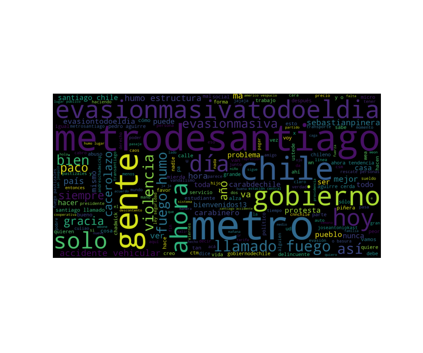
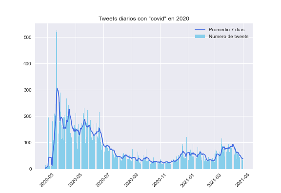

# Twitter Analysis Using Latent Dirichlet Allocation (LDA)

The repository contains a topic modeling study applied on tweets acting as text data. As a first analysis, tweets created mainly in Santiago Chile during the social outbreak, in Santiago containing the word "covid" during 2020, in Santiago containing the word "piñera" during 2020 and during 2020 international women's day are collected. Wordclouds and time series are created with the said data.

The project main study is applied on tweets created by Gabriel Boric (@gabrielboric), a 2022 chilean president candidate.  

More detailed info can be found in "lda_twitter.pdf" file.